# 20241103_Ibaraki_bike

<html>
<head>

<meta charset="UTF-8">
<meta http-equiv="Content-Type" content="text/html; charset=UTF-8">
<meta http-equiv="X-UA-Compatible" content="IE=EmulateIE10" />
<meta http-equiv="X-UA-Compatible" content="IE=edge">

<!--ここから上はお決まりの定型文です-->

<!--ここからが表現の書式などを決めるcssという部分-->

<link href="https://cdnjs.cloudflare.com/ajax/libs/lightbox2/2.7.1/css/lightbox.css" rel="stylesheet">

</head>

<body>

モバイル端末をお使いの場合は、画面を横向きにすると
より見やすくご覧頂けます。

<!--ここ上は、ほぼそのまま使います！-->

<!--QRコードの挿入例-->

 アクセス用QRコード

<marquee direction="left" scrollamount="20" width="30%">(^_^)/~hada</marquee>

<!--流れ文字の挿入例-->
<h1><marquee behavior="left">!!! 2024/11/03 、浜田さんツーリング for 茨城県大子 !!!</marquee></h1>

<!--上段にパンクズリストを入れる時の例-->
<!--

<a href="https://torokoid.github.io/Mashiko_himawari_4/" target="_blank">2024年8月10日、益子ひまわり祭</a>><a href="https://torokoid.github.io/20240817_hagurosan/" target="_blank">2024年8月17日、羽黒山</a>><a href="https://torokoid.github.io/20240930_hagurosan/" target="_blank">2024年9月30日、羽黒山</a>><a href="https://torokoid.github.io/20241003_cluster/" target="_blank">10月3日、Cluster Accelerator</a>><a>羽田さんの悠々自適な１カ月を根掘り葉掘りする会@ふくわうち</a>

-->
                          

<!--ここから下が、本体部分-->

<h2>安住神社に集合して、ツーリング、スタート！</h2>
<a href="20241103_01.jpg" target="_blank">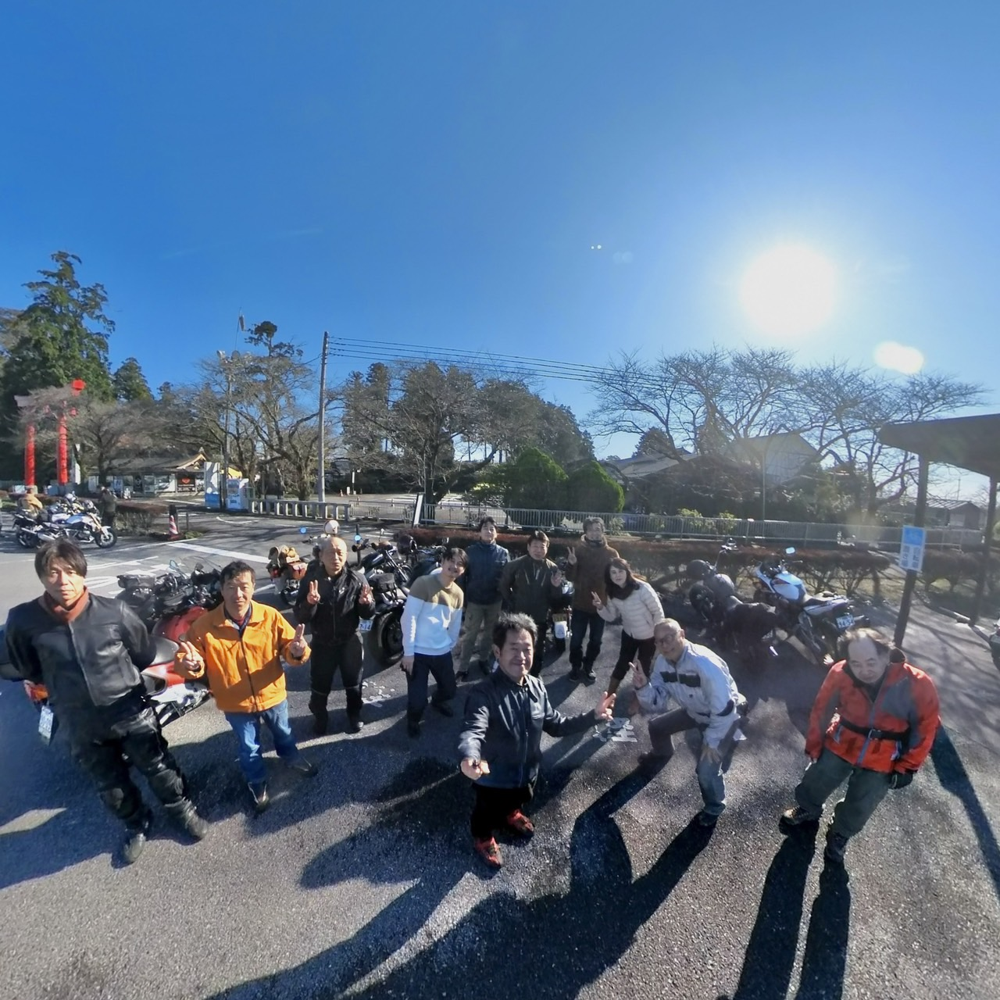</a>

<a href="20241103_03.jpg" target="_blank">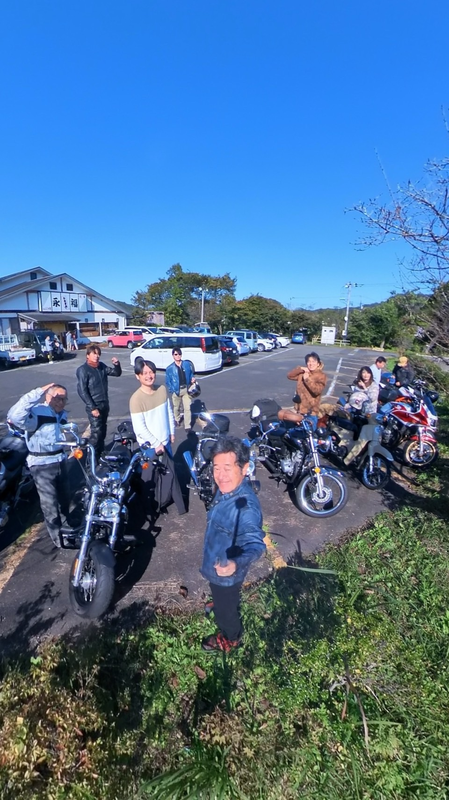</a>

<h2>モンキーのリアフェンダーがタイヤと当たってたので外しました！</h2>
<a href="20241103_05.jpg" target="_blank">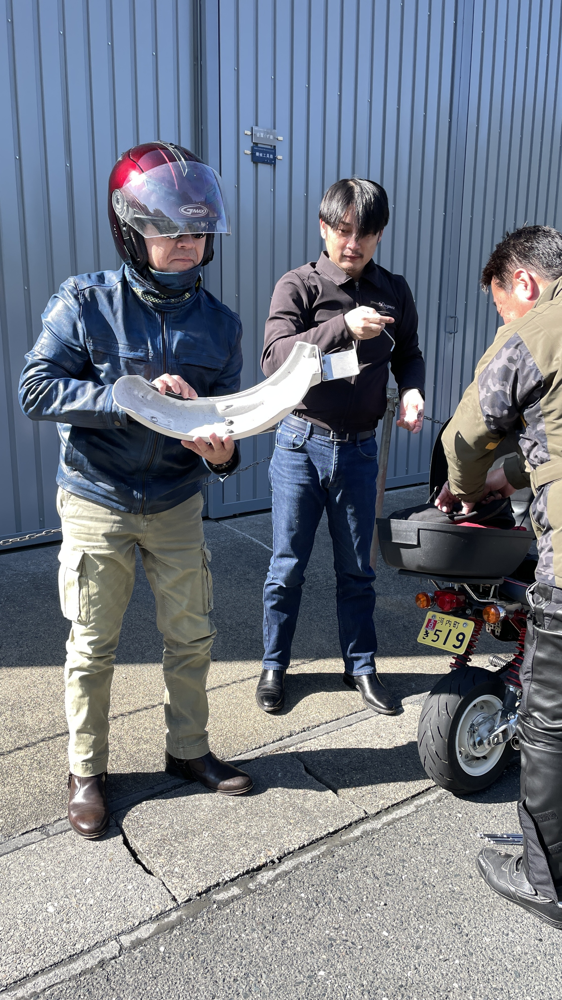</a>

   

<h2>動画です。1、２本目はLINE共有動画、３、４本目はGoProで撮ったAppleLineのほぼ全域走行動画！</h2>

<iframe width="560" height="315" src="https://www.youtube.com/embed/sgq-xMSNCbo?si=XXyADHd2-dXv7s1b" title="YouTube video player" frameborder="0" allow="accelerometer; autoplay; clipboard-write; encrypted-media; gyroscope; picture-in-picture; web-share" referrerpolicy="strict-origin-when-cross-origin" allowfullscreen></iframe> 

<iframe width="560" height="315" src="https://www.youtube.com/embed/r2r66Sdn9J4?si=yeClYc32zpkKcx0p" title="YouTube video player" frameborder="0" allow="accelerometer; autoplay; clipboard-write; encrypted-media; gyroscope; picture-in-picture; web-share" referrerpolicy="strict-origin-when-cross-origin" allowfullscreen></iframe> 

<iframe width="560" height="315" src="https://www.youtube.com/embed/zwjTc3mG1AQ?si=5I3r66FCx5ywaI6n" title="YouTube video player" frameborder="0" allow="accelerometer; autoplay; clipboard-write; encrypted-media; gyroscope; picture-in-picture; web-share" referrerpolicy="strict-origin-when-cross-origin" allowfullscreen></iframe> 

<iframe width="560" height="315" src="https://www.youtube.com/embed/9kRn1tfFwx0?si=YTwMgYgPV-7x10Ls" title="YouTube video player" frameborder="0" allow="accelerometer; autoplay; clipboard-write; encrypted-media; gyroscope; picture-in-picture; web-share" referrerpolicy="strict-origin-when-cross-origin" allowfullscreen></iframe> 

   
<h2>羽田スマホ画像！</h2>
<a href="20241103_001.JPG" target="_blank">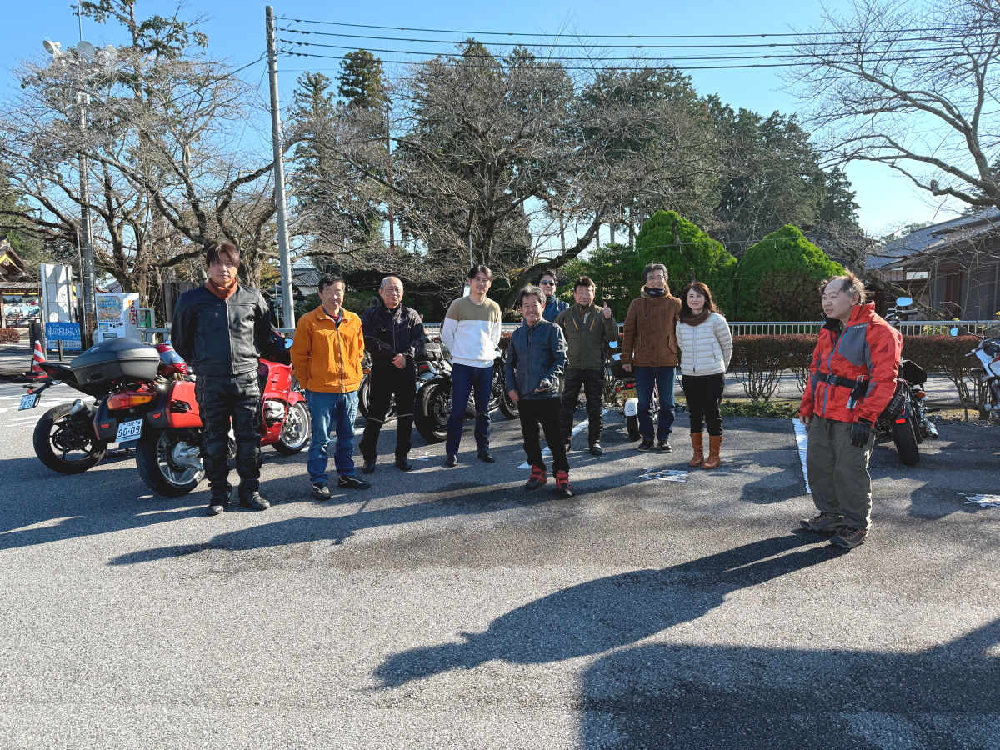</a>

<a href="20241103_004.JPG" target="_blank">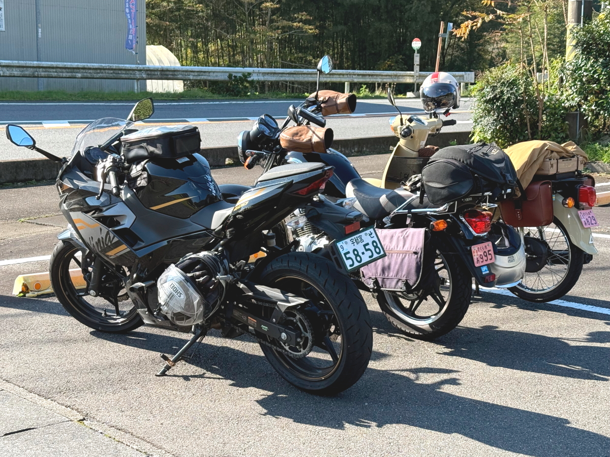</a>

<a href="20241103_006.JPG" target="_blank">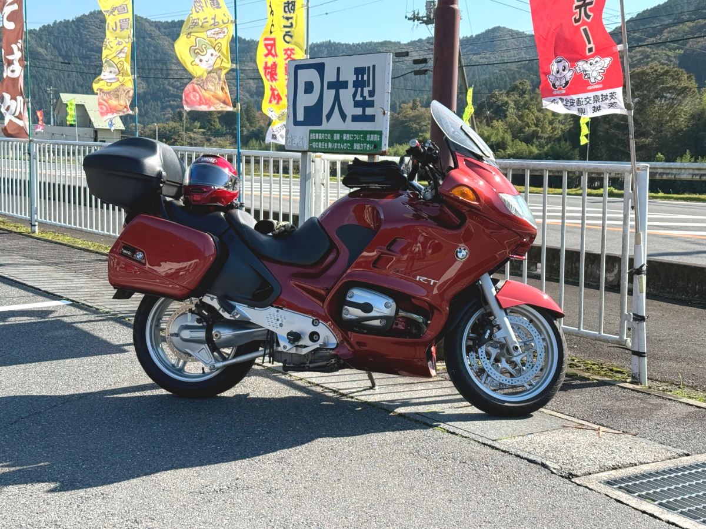</a>
<!--<h2>道の駅のトイレが珍しい形でした！</h2>
-->

<a href="20241103_009.JPG" target="_blank">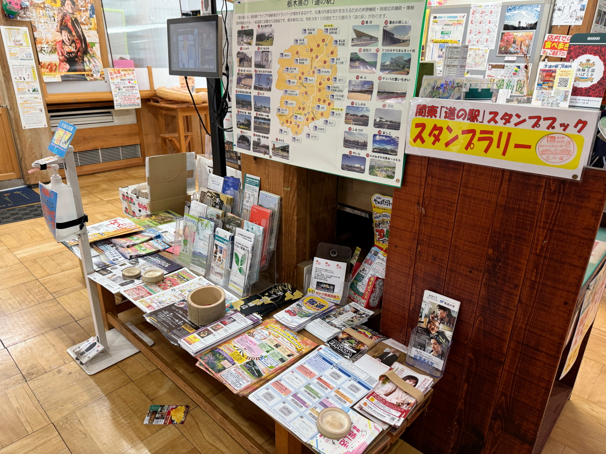</a>
<a href="20241103_010.JPG" target="_blank">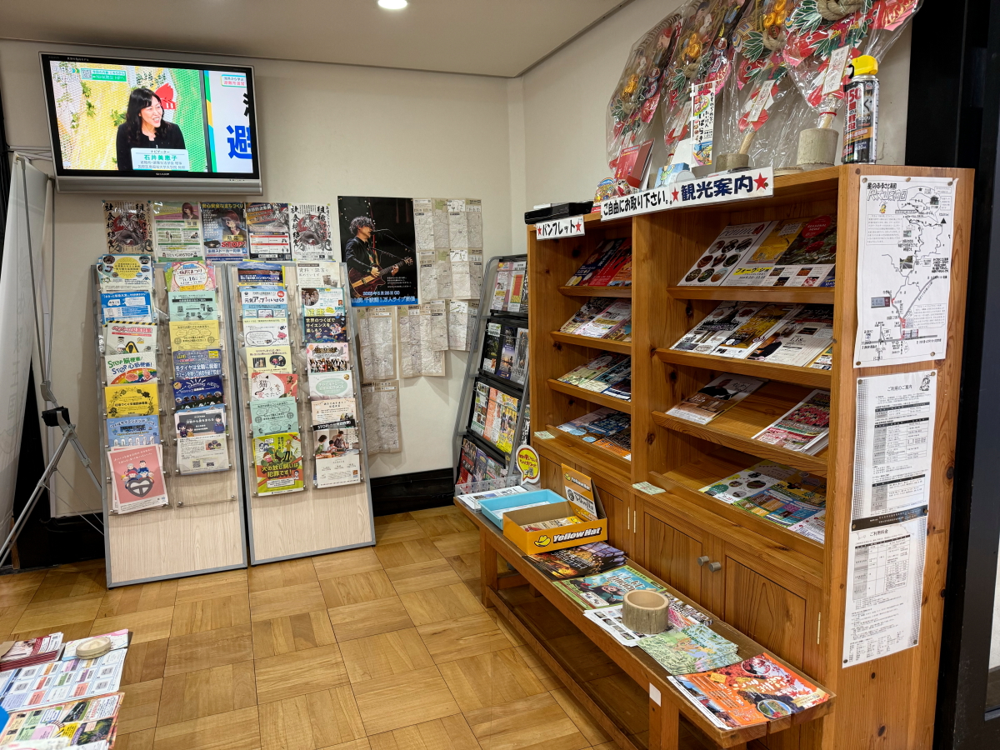</a>

<a href="20241103_014.JPG" target="_blank">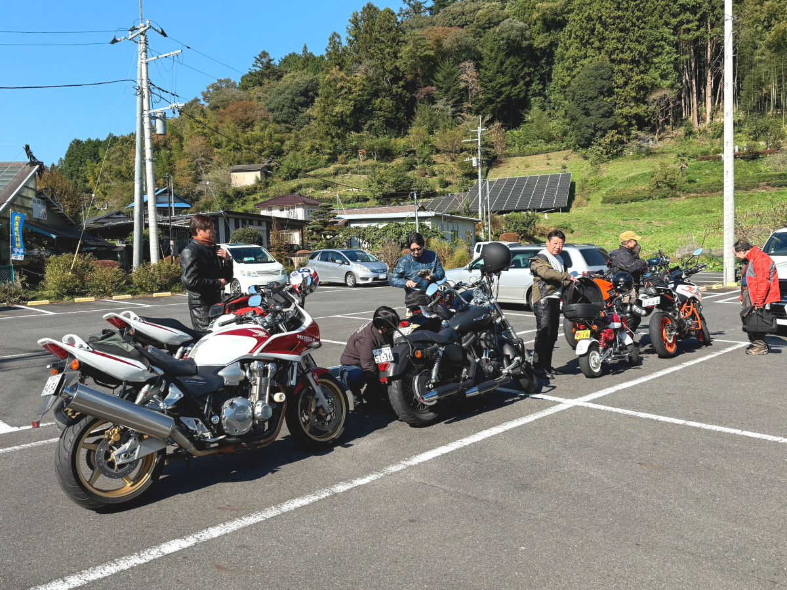</a>
<a href="20241103_015.JPG" target="_blank">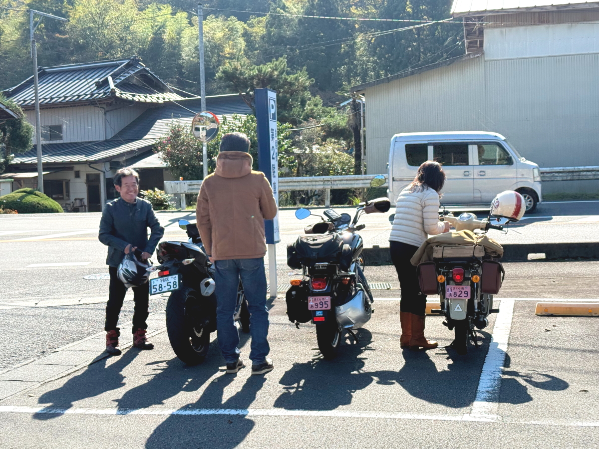</a>
<a href="20241103_016.JPG" target="_blank">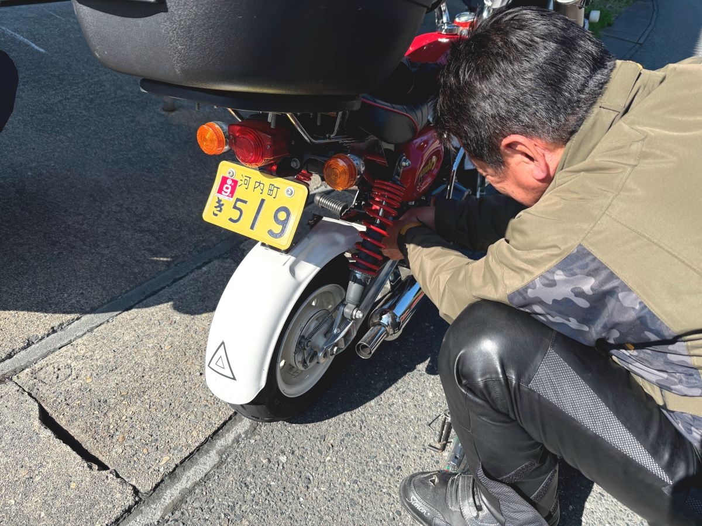</a>

<h2>15食限定、唐揚げ定食は¥1,000！</h2>
<a href="20241103_019.JPG" target="_blank">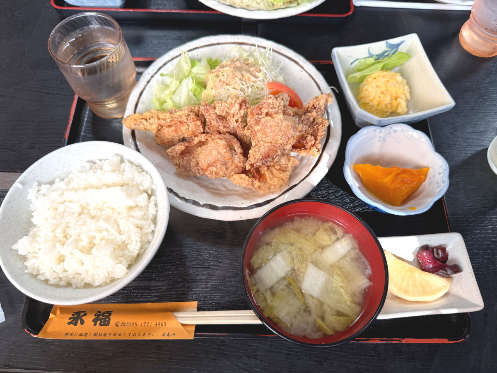</a>
<a href="20241103_020.JPG" target="_blank">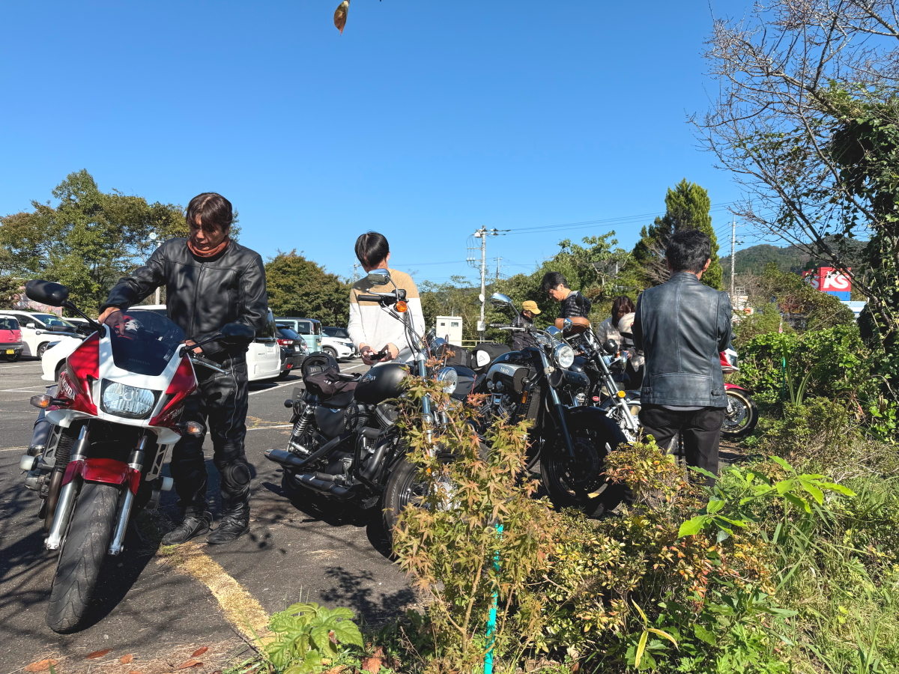</a>
<a href="20241103_021.JPG" target="_blank">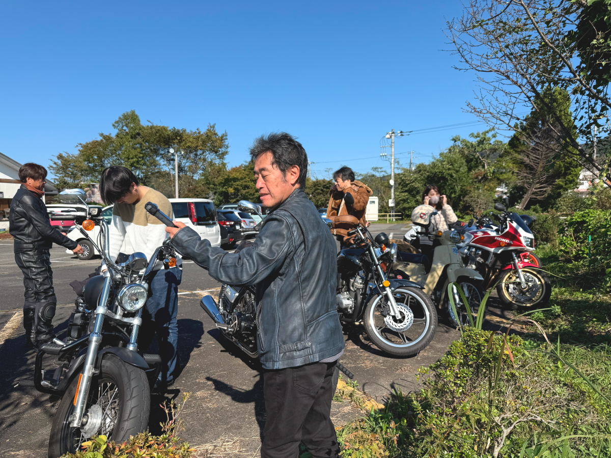</a>

<!--

<h2>集合写真！</h2>

-->

   

   

 <!--
<h2>残暑厳しい中、水泳メンバーが集まりました みんな元気そうです では、又の再会を楽しみにしています！</h2>-->

         

  

      

<!--本体はここまで-->

<!--画面に空白地帯を作って、背景が見えるようにしています-->
                                              

<!-- フッタ -->
<footer>

Copyright 2024/11/03 S.Hada

</footer>

<!--HPにさまざまなJavaScriptを呼び込むための書式-->

